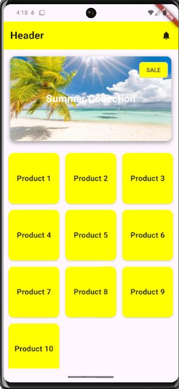

# Day 8 – Row, Column, Stack, ListView/GridView (Concept/Lecture, 60 mins)

1. Layout Fundamentals — Constraints (≈10 mins)
	•	Core Flutter layout rule: "Constraints go down, sizes go up, parent sets position" — a widget's size is determined by its parent's constraints combined with its own content, and the parent decides where to place the child
	•	Briefly explain BoxConstraints (minWidth/maxWidth/minHeight/maxHeight) so learners understand why certain layout errors happen (e.g., "unbounded height" errors when nesting lists)
	•	This foundation matters for Intermediate level because it explains why certain combinations (like ListView inside Column without constraints) throw runtime errors — a very common bug
2. Row & Column (≈15 mins)
	•	Row (horizontal) and Column (vertical) — Flutter's primary linear layout widgets
	•	Key properties:
	◦	mainAxisAlignment — alignment along the primary direction (start, center, spaceBetween, spaceAround, spaceEvenly)
	◦	crossAxisAlignment — alignment perpendicular to the primary direction
	◦	mainAxisSize (max vs min) — whether the Row/Column takes all available space or shrinks to fit children
	•	Expanded vs Flexible:
	◦	Expanded forces a child to fill remaining space
	◦	Flexible allows a child to take up space proportionally but won't force it if there's room to shrink
	◦	flex property to control proportional sizing among multiple Expanded/Flexible children
	•	Common error: RenderFlex overflowed — explain why it happens (children's combined size exceeds available space) and how to fix it (Expanded, Flexible, SingleChildScrollView, or Wrap)
3. Stack (≈10 mins)
	•	Stack — layers widgets on top of each other (z-axis), useful for overlays, badges, floating buttons, image with text overlay
	•	Positioned widget — precisely place a child within a Stack using top/bottom/left/right
	•	Alignment property on Stack — default alignment for non-positioned children
	•	Real example: a product card with an image, a "Sale" badge positioned at the top-right corner
4. ListView & GridView (≈20 mins)
	•	ListView:
	◦	ListView() (fixed children) vs ListView.builder() (lazy-built, efficient for long/dynamic lists — always prefer .builder() in real projects)
	◦	ListView.separated() — adds dividers/spacing between items automatically
	◦	shrinkWrap and physics properties — when and why to use them (e.g., nesting a ListView inside a Column/ScrollView)
	•	GridView:
	◦	GridView.count() — fixed number of columns
	◦	GridView.builder() with SliverGridDelegateWithFixedCrossAxisCount or SliverGridDelegateWithMaxCrossAxisExtent — for dynamic, responsive grids
	◦	Use case comparison: ListView for linear content (chat, feed, settings list), GridView for visual/card-based content (product catalog, photo gallery)
	•	Performance note: .builder() constructors only render visible items + a buffer, which is critical for real-project performance with large datasets — connects forward to Unit 4 (rebuild optimization)
5. Combining Layouts for Real UI (≈5 mins)
	•	Quick example combining all four: a screen with a Column containing a header Row, a Stack-based banner, and a GridView.builder() for content below
	•	Reinforce the mindset: real UIs are built by composing these basic layout widgets, not using one in isolation

# Day 9: Layout practice
 
Task: Recreate a given UI mockup using Row/Column/Stack/ListView/GridView.
Deliverable: Screen matching mockup ±10% layout accuracy.
Evidence: Side-by-side screenshot comparison with mockup.
Rubric: Layout accuracy (50%), responsiveness (30%), code structure (20%).

# Assignment screenshot:
