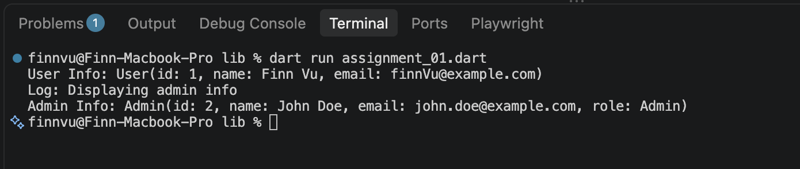

# Day 1: Null safety & OOP recap
* Null Safety (≈30 mins)
* Sound null safety concept: nullable (?) vs non-nullable types
* late keyword and when to use it safely
* Null-aware operators: ??, ??=, ?., ! (and risks of misusing !)
* Common pitfalls: force-unwrap crashes, improper late initialization
* Best practices for null safety in real project code (avoid overusing !)
* OOP Recap – Core Concepts (≈35 mins)
* Class, constructor (default, named, factory constructors)
* Inheritance vs Composition — when to use which in Flutter context
* Abstract class vs Interface (implements) in Dart
* Mixins (with) — use cases in Flutter (e.g., SingleTickerProviderStateMixin)
* Encapsulation & access modifiers (_privateMember convention in Dart)
* Intermediate-level Application (≈15 mins)
* How OOP design choices affect widget/state architecture later in the course
* Quick examples: modeling a data class with null safety (e.g., User, Ticket model)
* Preview: connect to Unit 5 (State Management) — why solid OOP matters for Provider/Bloc
* Wrap-up & Q&A (≈10 mins)
* Recap key differences vs what learners already know at Junior level
* Assign Self-learning material for Day 2 (async/await preview reading)

# Day 2: Practice
Task: Write Dart classes using null safety & OOP (inheritance, mixin).
Deliverable: .dart file with 2 classes + 1 mixin, compiled without errors.
Evidence: Screenshot of successful run + code pushed to Git branch.
Rubric: Correct null-safety usage (30%), OOP structure (40%), code readability (30%).

# Run evidence

